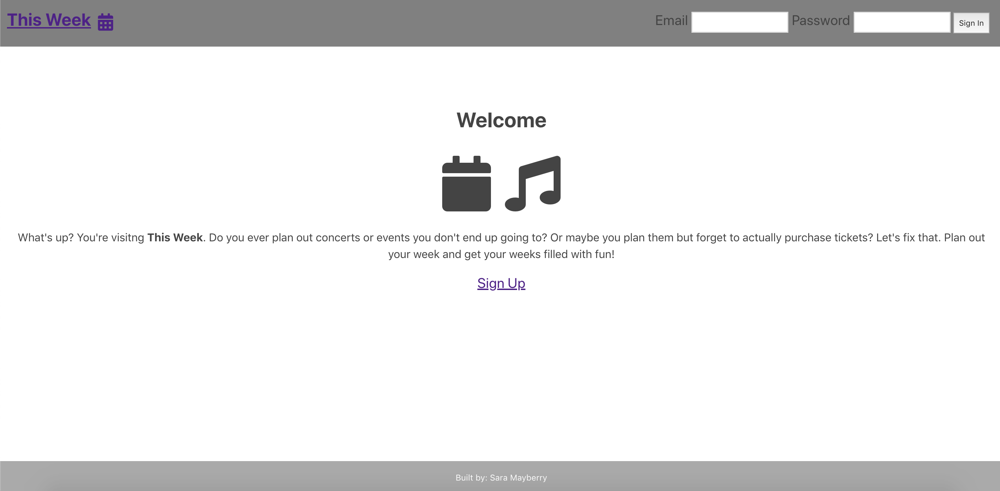

# Just Go
Just Go is an app that allows you to search events by name, location or type and then save them to your profile to potentially purchase later. It uses SeatGeek API to facilitate the search feature and links you to their site to purchase tickets! Stop saying maybe, and Just Go! <br>

<a href="https://github.com/bahitssara/just-go-api" target="_blank">Just Go API Repo</a><br>
<a href="https://github.com/bahitssara/Just-Go" target="_blank">Just Go Client Repo</a><br>
<a href="https://just-go-app.now.sh/" target="_blank">Live Just Go Application</a>

## Motivation
As an avid concert goer, I have a very hard time remembering what events are in my area, or which I was planning on attending! From that experience, I came up with the idea for Just Go. This app not only allows you to search concerts but any listed local events that may require a ticket purchase. This app is an easy way for people like me to never forget an event they may want to attend, or even just entertain their wishful thinking and save them just in case!

## <u>User-stories, UX Wireframes, Screenshots</u>

#### As a user I want to create an account



#### As a user I want to search events


## <Center>Desktop view</center>
#### Home page

#### Registration page

#### Events page


## Summary
Sign up, search events by location, event type, artist, musician, venue, ANYTHING. Save these events to your profile to either remember the events you're already attending OR save them to get tickets when you can. Whether it's wishful thinking or a full on game plan, Just Go!

## Built with
  ### Front end
    -HTML
    -Javascript
    -React
    -CSS

  ### Back end
    -Node.js
    -Express.js
    -PostgreSQL
    -Mocha and Chai for testing

  ### 3rd Party API
  #### SeatGeek
  For issues or questions visit their API support page.
  <a href="https://github.com/seatgeek/api-support" target="_blank">SeatGeek API Support</a><br>

## Development road map
  * Allow for manual addition of events for any event that doesn't populate in the search, but you still want to remember to attend.
  * See other's saved events and allow for sharing.
  * Add an 'Attending' badge if you have already purchased tickets.


## Available Scripts

### Node Js
  ```npm install``` - Installs node modules<br>
  ```npm run dev```- Starts development/node server<br>
  ```npm test``` - Runs tests

### React
  ```npm install``` - Installs node modules<br>
  ```npm test``` - Runs tests
  ```npm start``` - Runs React App in development mode<br>
  Open [http://localhost:3000](http://localhost:3000) to view it in the browser.<br>


The page will reload if you make edits.<br>
You will also see any lint errors in the console.
